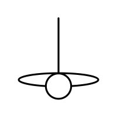

# Welcome to LightSeek Foundation

<a href="https://lightseek.org"> [LightSeek Foundation](https://lightseek.org/) is a 501(c)(3) nonprofit organization advancing open research and open-source innovation for the next generation of artificial intelligence systems. We believe the future of AI should be transparent, collaborative, and inclusive. LightSeek exists to accelerate the development of open, efficient, and trustworthy AI systems—so that progress in AI benefits everyone, not just a few.

LightSeek Foundation is a [Silver Member](https://pytorch.org/members) of the PyTorch Foundation.

## Governance and Disclaimer

**[Governance](https://lightseek.org/governance)**: LightSeek Foundation is a 501(c)(3) nonprofit governed by a one-director-one-vote board, while project maintainers make day-to-day technical decisions through open repository processes.

**[Disclaimer](https://lightseek.org/disclaimer)**: LightSeek Foundation and its projects operate on a **vendor-neutral, inclusive basis**, treating all ecosystem participants **equally** without implying affiliation, endorsement, exclusivity, or preferential treatment.

## Ecosystem Projects

**[SMG](https://github.com/lightseekorg/smg)**: Shepherd Model Gateway is a high-performance inference gateway for production LLM deployments.

**[TorchSpec](https://github.com/lightseekorg/TorchSpec)**: TorchSpec is a PyTorch native library for training speculative decoding models.

**[TokenSpeed](https://github.com/lightseekorg/tokenspeed)**: TokenSpeed is a speed-of-light LLM inference engine.

## Sponsors and Partners

LightSeek's work is advanced by the support of [sponsors and partners](https://lightseek.org/sponsors) across the AI ecosystem.

## Follow Us

Stay connected with the LightSeek Foundation. Follow us for the latest updates on open research, infrastructure, and open-source AI systems.

<a href="https://lightseek.org/blog"> https://lightseek.org/blog

<a href="https://lnkd.lightseek.org"> https://lnkd.lightseek.org

<a href="https://x.com/lightseekorg"> https://x.com/lightseekorg

<a href="https://github.lightseek.org"> https://github.lightseek.org

<a href="https://hf.co/lightseekorg"> https://hf.co/lightseekorg

## Contact Us

We welcome collaboration with researchers, engineers, and organizations worldwide. For partnerships, research collaboration, sponsorship opportunities, or general inquiries, please reach out to us.

<a href="mailto:contact@lightseek.org"> contact@lightseek.org
